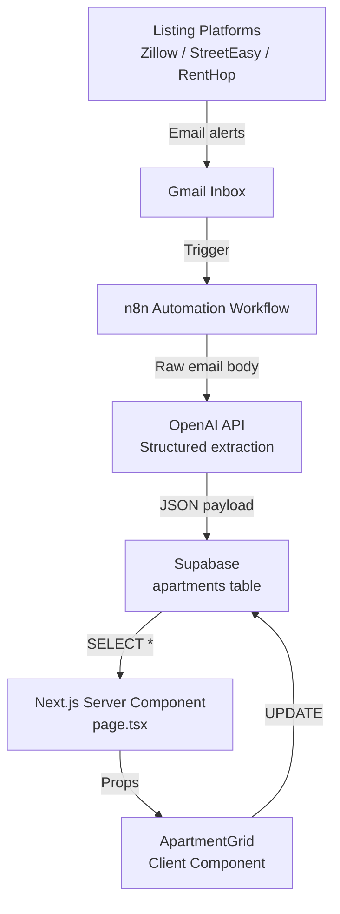
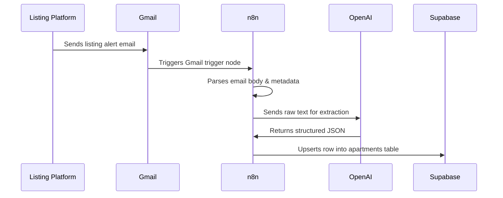
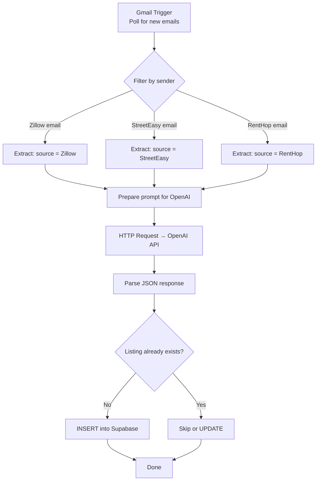
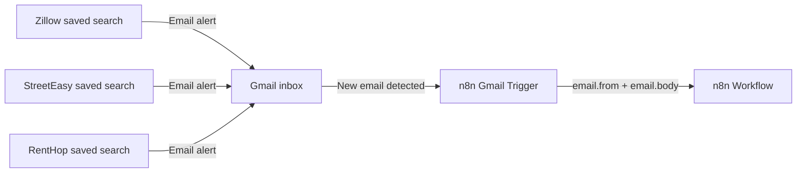
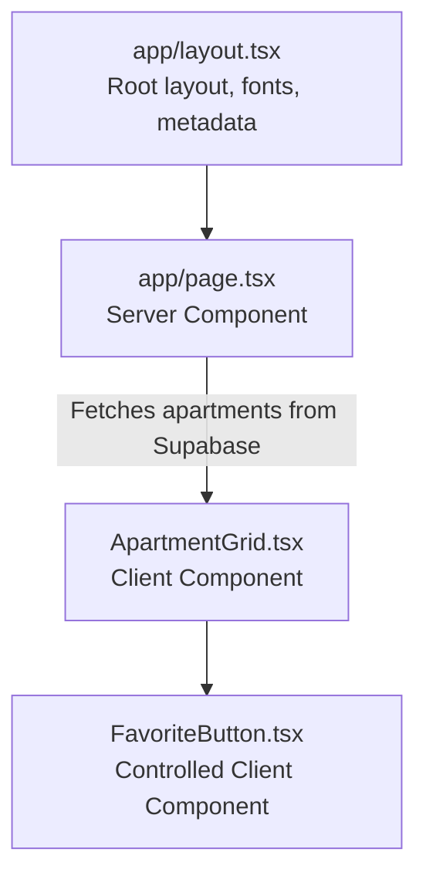
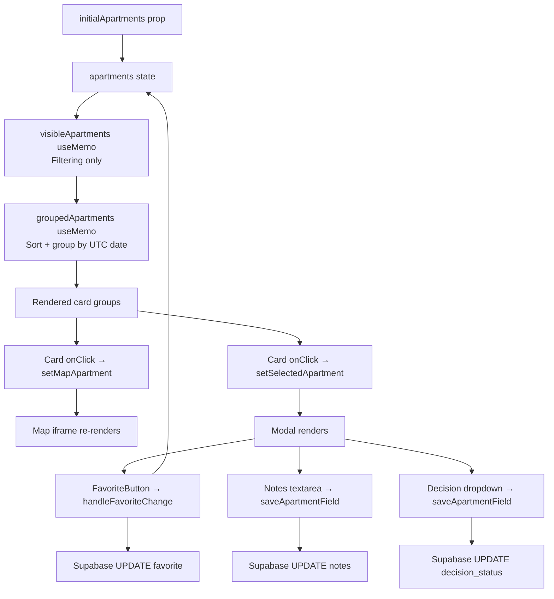
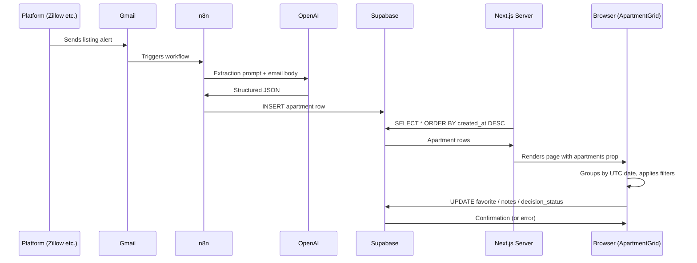
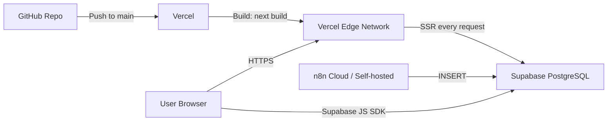

# Apartment Radar — Architecture Documentation

Technical reference for engineers working on the Apartment Radar platform.

---

## Table of Contents

1. [System Overview](#system-overview)
2. [Data Ingestion Pipeline](#data-ingestion-pipeline)
3. [n8n Workflows](#n8n-workflows)
4. [OpenAI Integration](#openai-integration)
5. [Gmail Ingestion Flow](#gmail-ingestion-flow)
6. [Supabase Schema](#supabase-schema)
7. [Frontend Architecture](#frontend-architecture)
8. [Component Architecture](#component-architecture)
9. [State Management](#state-management)
10. [Data Flow — End to End](#data-flow-end-to-end)
11. [Deployment Architecture](#deployment-architecture)
12. [Known Constraints & Design Decisions](#known-constraints--design-decisions)

---

## System Overview

Apartment Radar is composed of three distinct layers:



| Layer | Purpose | Technology |
|---|---|---|
| Ingestion | Capture listings from external platforms | Gmail, n8n |
| Extraction | Parse unstructured listing text into structured fields | OpenAI API |
| Storage | Persist listings and user annotations | Supabase (PostgreSQL) |
| Frontend | Display, filter, and annotate listings | Next.js 16, React 19, Tailwind CSS v4 |

---

## Data Ingestion Pipeline

Listings enter the system via email alerts. Each of the three supported platforms (Zillow, StreetEasy, RentHop) sends automated listing emails when new apartments match a saved search. These emails arrive in a designated Gmail inbox.



### Why email-based ingestion?

All three platforms provide email alert subscriptions for saved searches — this requires no API credentials, no scraping, and no terms-of-service risk. It is the most durable and lowest-maintenance ingestion path available without official API access.

---

## n8n Workflows

n8n is the automation backbone of the ingestion pipeline. Each source may have a dedicated workflow, or a single workflow may branch by source based on the sender address.

### Workflow Structure (per source)



### Key n8n Nodes Used

| Node | Purpose |
|---|---|
| Gmail Trigger | Polls inbox at a set interval for new listing emails |
| Function / Code | Parses email metadata, extracts sender domain to determine source |
| HTTP Request | Calls the OpenAI Chat Completions API |
| Supabase Node (or HTTP) | Inserts or upserts the extracted listing into the database |
| IF | Routes by source or checks for duplicates |

### Deduplication Strategy

Deduplication is currently address-based. Before inserting, the workflow checks whether a row with the same `address` and `source` already exists. If it does, the row is skipped (or optionally updated if rent or status has changed).

---

## OpenAI Integration

OpenAI is used at ingestion time only. It receives the raw text body of a listing email and returns a structured JSON object representing the apartment.

### Prompt Design

The prompt instructs the model to extract specific fields from an unstructured email body. A system prompt defines the expected output schema. A JSON mode or function-calling mode is used to guarantee parseable output.

**Target extraction schema:**

```json
{
  "address": "123 Bedford Ave, Brooklyn, NY 11211",
  "neighborhood": "Williamsburg",
  "rent": 3200,
  "bedrooms": 2,
  "bathrooms": 1,
  "sqft": 850,
  "pets_allowed": "Cats OK",
  "listing_agent": "Jane Smith",
  "listing_url": "https://streeteasy.com/listing/..."
}
```

### Model Selection

`gpt-4o-mini` is the recommended model for this task — it is fast, inexpensive, and accurate enough for structured field extraction from short listing text. `gpt-4o` can be used as a fallback for low-confidence extractions.

### Error Handling

If OpenAI returns malformed JSON or omits required fields (at minimum: `address` and `rent`), the n8n workflow should discard the record and optionally log it for review. Partial records with missing optional fields (sqft, pets, agent) are acceptable and inserted with null values.

---

## Gmail Ingestion Flow



### Gmail Setup Requirements

1. Create saved searches on Zillow, StreetEasy, and RentHop with your criteria (location, max rent, min bedrooms, etc.)
2. Enable email alerts on each saved search
3. Connect the Gmail account to n8n using OAuth2
4. Configure the Gmail Trigger node to poll at an appropriate interval (e.g., every 5–15 minutes)
5. Use a filter or label in Gmail to keep listing emails organized

### Identifying the Source

The `source` field is derived from the sender email domain:
- `@zillow.com` → `"Zillow"`
- `@streeteasy.com` → `"StreetEasy"`
- `@renthop.com` → `"RentHop"`

This avoids relying on the email subject line or body content to identify the platform.

---

## Supabase Schema

### `apartments` table

```sql
create table apartments (
  id              uuid primary key default gen_random_uuid(),
  listing_url     text,
  source          text,
  address         text not null,
  neighborhood    text,
  rent            integer not null,
  bedrooms        integer not null default 0,
  bathrooms       numeric,
  sqft            integer,
  pets_allowed    text,
  listing_agent   text,
  status          text,
  favorite        boolean not null default false,
  notes           text,
  decision_status text,
  created_at      timestamptz not null default now()
);
```

### Field Reference

| Field | Type | Source | Description |
|---|---|---|---|
| `id` | uuid | Supabase | Auto-generated primary key |
| `listing_url` | text | OpenAI | Deep link to the original listing |
| `source` | text | n8n | Platform origin: `Zillow`, `StreetEasy`, or `RentHop` |
| `address` | text | OpenAI | Full street address |
| `neighborhood` | text | OpenAI | Neighborhood name |
| `rent` | integer | OpenAI | Monthly rent in USD |
| `bedrooms` | integer | OpenAI | Number of bedrooms |
| `bathrooms` | numeric | OpenAI | Number of bathrooms |
| `sqft` | integer | OpenAI | Square footage (nullable) |
| `pets_allowed` | text | OpenAI | Pet policy string (nullable) |
| `listing_agent` | text | OpenAI | Agent or broker name (nullable) |
| `status` | text | OpenAI | Listing status (Active, etc.) |
| `favorite` | boolean | User | Whether the user has saved the listing |
| `notes` | text | User | Free-text notes, editable in the UI |
| `decision_status` | text | User | `Interested`, `Tour`, `Applied`, or `Rejected` |
| `created_at` | timestamptz | Supabase | Timestamp of ingestion — used for "New Today" grouping |

### Row Level Security

RLS is enabled on the `apartments` table. Two policies are required:

```sql
-- Allow the anonymous role to read all listings
create policy "Allow anon select"
  on apartments for select to anon using (true);

-- Allow the anonymous role to update user-owned fields
create policy "Allow anon update"
  on apartments for update to anon using (true);
```

> Without the UPDATE policy, Supabase silently returns an empty array `[]` on `.update()` calls without throwing an error, making favorites and notes appear to save while actually discarding all writes.

---

## Frontend Architecture

The frontend is a Next.js 16 App Router application with a clean two-layer architecture: one Server Component that owns data fetching, and one Client Component that owns all interactivity.



### File Structure

```
apartment-finder/
├── app/
│   ├── layout.tsx              # Root layout — fonts, metadata, body
│   ├── page.tsx                # Server Component — data fetching, nav, shell
│   ├── globals.css             # Tailwind v4 import
│   └── components/
│       ├── ApartmentGrid.tsx   # Core UI — all listing logic
│       └── FavoriteButton.tsx  # Controlled favorite toggle
├── lib/
│   └── supabase.ts             # Shared Supabase client
├── .env.local                  # Environment variables (not committed)
├── package.json
└── tsconfig.json
```

### Server vs. Client Component Split

| File | Type | Reason |
|---|---|---|
| `layout.tsx` | Server | Static shell, no interactivity needed |
| `page.tsx` | Server | Data fetching via Supabase; `force-dynamic` ensures fresh data on every request |
| `ApartmentGrid.tsx` | Client (`"use client"`) | Filters, modal, map state, Supabase writes all require browser APIs and event handlers |
| `FavoriteButton.tsx` | Client (`"use client"`) | Requires `onClick` handler |

### Styling

Tailwind CSS v4 is used throughout. Key differences from v3:
- No `tailwind.config.js` — configuration lives in `globals.css` via `@import "tailwindcss"`
- Arbitrary values (`h-[calc(100vh-140px)]`, `grid-cols-[560px_1fr]`) are used for layout-specific values that don't have a semantic Tailwind token

---

## Component Architecture

### `ApartmentGrid.tsx`

The core component. It receives the full list of apartments as a prop from the server and manages all client-side state locally.



#### Helper Functions

| Function | Purpose |
|---|---|
| `utcDateKey(d)` | Converts a Date to `YYYY-MM-DD` using UTC methods to prevent server/client timezone mismatch |
| `isNew(createdAt)` | Returns true if the listing was added on today's UTC date |
| `formatAddedDate(createdAt)` | Returns `"Added today"` or `"Added Jun 16"` for card display |
| `getDateGroupKey(createdAt)` | Returns the UTC `YYYY-MM-DD` key used to group listings |
| `formatGroupLabel(dateKey)` | Converts a date key to `"New Today"`, `"Yesterday"`, or `"June 16, 2026"` |
| `sourceBadgeClasses(source)` | Returns Tailwind classes for source-colored badges |
| `decisionBadgeClasses(status)` | Returns Tailwind classes for decision status badges |

### `FavoriteButton.tsx`

A fully controlled, stateless component. It holds no internal state and makes no Supabase calls directly. All logic lives in `ApartmentGrid.handleFavoriteChange`.

**Props:**
- `apartmentId: string`
- `favorite: boolean`
- `onFavoriteChange: (id: string, favorite: boolean) => void`

This design ensures the button always reflects the authoritative state in `ApartmentGrid` and cannot become out of sync with the card grid or the modal.

---

## State Management

`ApartmentGrid` uses local React state only — no global state library. This is sufficient because the entire app is a single page with one component tree.

| State | Type | Purpose |
|---|---|---|
| `apartments` | `Apartment[]` | Master list — mutated optimistically on favorite change |
| `search` | `string` | Text filter |
| `source` | `string` | Source dropdown filter |
| `selectedNeighborhoods` | `string[]` | Multi-select neighborhood chips |
| `showFavoritesOnly` | `boolean` | Saved listings toggle |
| `maxRent` | `string` | Max rent filter |
| `minBedrooms` | `string` | Min bedrooms filter |
| `sortBy` | `SortOption` | `newest` / `rent-low` / `rent-high` |
| `mapApartment` | `Apartment \| null` | Currently pinned on the homepage map |
| `selectedApartment` | `Apartment \| null` | Currently open in the detail modal |
| `saveStatus` | enum | `idle` / `saving` / `saved` / `error` — shown in modal |

### Optimistic Updates

Favorites use optimistic UI: the local `apartments` state is updated immediately before the Supabase call resolves. If the call fails, a functional state update rolls back to the previous value.

```
User clicks ♡
  → setApartments (optimistic: favorite = true)
  → setSelectedApartment (optimistic: favorite = true)
  → await supabase.update(...)
    → success: console.log ✓
    → failure: setApartments (rollback: favorite = false)
               setSelectedApartment (rollback: favorite = false)
               alert(error message)
```

### Debounced Notes Saving

Notes use a `useRef`-backed debounce timer so the database is not written on every keystroke:

```
User types in notes textarea
  → onChange: clear existing timer, start 1000ms timer
    → timer fires: saveApartmentField(id, "notes", value)
  → onBlur: clear timer, call saveApartmentField immediately
```

---

## Data Flow — End to End



---

## Deployment Architecture



### Vercel Configuration

- **Framework:** Next.js (auto-detected)
- **Build command:** `npm run build`
- **Output directory:** `.next`
- **Environment variables:** `NEXT_PUBLIC_SUPABASE_URL`, `NEXT_PUBLIC_SUPABASE_ANON_KEY`
- **Cache:** Disabled via `export const dynamic = "force-dynamic"` and `export const revalidate = 0` in `page.tsx`

### Why `force-dynamic`?

Next.js 16 does not cache `fetch` by default, but Supabase JS uses its own client (not `fetch` directly in the same way). Using `force-dynamic` guarantees the server component always re-runs on every request, ensuring users always see the latest listings without a CDN cache invalidation step.

---

## Known Constraints & Design Decisions

### No authentication

The app is currently a single-user tool. There is no login, and the Supabase anon key is used for all reads and writes. RLS policies are permissive by design. Adding authentication would be the first step toward multi-user support.

### UTC-based date grouping

All date calculations (`isNew`, `getDateGroupKey`, `formatGroupLabel`) use UTC methods (`getUTCDate`, `getUTCMonth`, `getUTCFullYear`) rather than local time. This prevents a Next.js hydration mismatch where the server (running in UTC) and the browser (running in the user's local timezone) compute different date groups for the same listing timestamp, producing different rendered HTML and triggering React's hydration error.

### Google Maps via iframe embed

Maps are rendered using the Google Maps Embed API (`maps.google.com/maps?q=...&output=embed`). This requires no API key for basic usage and is the simplest possible integration. The `key` prop on the `<iframe>` element forces React to unmount and remount the iframe whenever the selected apartment changes, which is necessary because iframes do not re-render their content when only `src` changes.

### Email-based ingestion vs. direct API

Direct API access to Zillow, StreetEasy, and RentHop either requires a partnership agreement, is not publicly available, or requires scraping that risks ToS violation. Email-based ingestion via Gmail is the most sustainable and risk-free approach for a personal tool at this stage.
